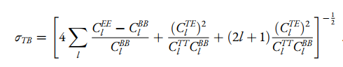

# Thesis Follow-up Project: Cosmic Birefringence Estimation with D-Estimators — A Numerical Extension

This repository contains a Python-based numerical extension of my Master's thesis:

**[Cosmic Birefringence with the CMB: A Harmonic-Based Methodology](https://hdl.handle.net/20.500.12608/79648)**  
MSc in Astrophysics and Cosmology — University of Padova

This project aims to implement and validate the harmonic-space **D-estimators** derived analytically in the thesis using simulated Cosmic Microwave Background (CMB) polarization maps and power spectra.

---

## Abstract of the Thesis

This thesis explores parity-violating extensions of standard electromagnetism, which can be realized through a Chern-Simons term coupling the dual of the electromagnetic tensor to a scalar field (or pseudo-scalar field, such as an axion-like field) where the latter may act as dark matter or dark energy. This interaction rotates the linear polarization of light in a manner similar to birefringent materials and is therefore commonly referred to as the **Cosmic Birefringence (CB)** effect. 

Since the Cosmic Microwave Background (CMB) is linearly polarized due to Thomson scattering at the last scattering surface, the CMB is often used to probe this phenomenon. In fact, recent analyses on Planck data have intriguingly hinted at a detection of CB with a statistical significance ranging from 2.4 to 3.6 sigma. These measurements have attracted significant attention in recent years, as they hold the potential to uncover new physics beyond the standard model of particle physics and cosmology.

In this thesis, we compute how CB affects the CMB angular power spectra. Additionally, we analytically derive two harmonic-based estimators, known in the literature as **D-estimators**, which constrain the CB effect by utilizing information from the TB (temperature anisotropies and B-mode polarization) and EB (E- and B-mode polarization) CMB angular power spectra. We verify that these estimators correctly recover the birefringence angle and assess their expected statistical efficiency, recovering known results from the literature. Additionally, we perform a detailed analysis of the joint estimator, obtained by combining the two D-estimators, and provide an analytical expression for the total joint uncertainty. While it is known that the joint estimator is dominated by the one derived from the EB spectrum, the final expression for the combined estimator can be considered new.

---

## Project Description

This project uses a simulation-based pipeline to evaluate the performance of D-estimators for measuring the birefringence angle $\beta$ in the Cosmic Microwave Background (CMB).

Key steps include:

1. **Loading Planck Fiducial CMB Spectra**  
   Theoretical spectra (TT, EE, BB, TE) are loaded from Planck 2018 data and converted to $C_\ell$.

2. **Generating Simulated CMB Maps**  
   Simulated full-sky maps of T, Q, and U are generated using `healpy.synfast` for a given angular power spectrum. A total of 100 realizations are produced to assess the stability and spread of the D-estimator outputs.

3. **Extracting Angular Power Spectra**  
   For each simulated map, we compute:
   - $C_\ell^{TT}$, $C_\ell^{EE}$, $C_\ell^{BB}$
   - $C_\ell^{TE}$, $C_\ell^{TB}$, $C_\ell^{EB}$
   using `healpy.anafast`.

4. **Applying D-Estimators**  
   The estimators implemented are:

   - **EB estimator:**
     $D_\ell^{EB}(\beta) = C_\ell^{EB,obs} \cos(4\beta) - \frac{1}{2} \left(C_\ell^{EE,obs} - C_\ell^{BB,obs}\right) \sin(4\beta)$

   - **TB estimator:**
     $D_\ell^{TB}(\beta) = C_\ell^{TB,obs} \cos(2\beta) - C_\ell^{TE,obs} \sin(2\beta)$

5. **Chi-Squared Analysis**  
   For each simulation, a chi-squared statistic is built for each estimator:

   - **EB estimator chi-squared:**
     
     
     

   - **TB estimator chi-squared:**
     
     

   - **Joint (EB+TB) estimator chi-squared:**
  
     
  
     where the inverse covariance matrix is:
  
     
 
   The value of $\beta$ that minimizes each $\chi^2(\beta)$ is taken as the best-fit birefringence angle for that simulation.

6. **Statistical Evaluation**  
   The best-fit $\beta$ from each simulation is collected. Their distribution is analyzed and compared to the analytical uncertainties derived in the thesis:

   - **EB estimator uncertainty:**

     

   - **TB estimator uncertainty:**

     
  
   - **Joint (EB+TB) estimator uncertainty:**

     

  These theoretical values are compared to the standard deviation of the $\beta$ values estimated from simulations. The analysis also includes the joint estimator, which is dominated by the EB contribution but benefits from the inclusion of TB information for completeness.

---

## 📊 Results

The results from the simulations are in good agreement with the analytical predictions obtained from the uncertainty analysis of the cosmic birefringence angle, constructed using D-estimators based on CMB polarisation. Below, we present a comparison between simulation-based results and theoretical (analytical) expectations for an idealised scenario with full-sky coverage and no instrumental noise.

Final $\sigma_\beta$ Constraints: Simulations vs. Analytical Predictions

- EB Estimator

   Simulation: $\sigma_\beta^{\mathrm{(EB)}} = 0.0015^\circ$

   Analytical (up to $\ell_{\max}=1024$): $\sigma_\beta^{\mathrm{(EB)}} = 0.0016^\circ$

- TB Estimator

   Simulation: $\sigma_\beta^{\mathrm{(TB)}} = 0.0049^\circ$

   Analytical (up to $\ell_{\max}=1024$): $\sigma_\beta^{\mathrm{(TB)}} = 0.0052^\circ$

- Joint Estimator

   Simulation: $\sigma_{\beta,\mathrm{joint}} = 0.0015^\circ$

   Analytical (up to $\ell_{\max}=1024$): $\sigma_{\beta,\mathrm{joint}} = 0.0016^\circ$

---

## 🛠 Tools and Libraries

- `healpy` – for CMB map simulation and power spectrum analysis
- `numpy` – for array operations and numerical computation
- `matplotlib` – for plotting power spectra and histograms
- Planck 2018 fiducial spectra file

---

## Future Work

Future work will extend this analysis to more realistic CMB scenarios by incorporating:

- instrumental noise,

- incomplete sky coverage, and

- finite optical resolution.

---

This project is a numerical continuation of my thesis, developed under the supervision of Dr. Alessandro Gruppuso (INAF, OAS Bologna) and Simone Paradiso (INAF, OAS Bologna).
